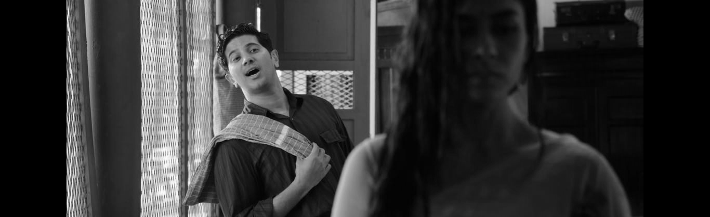

# READ AND WRITE AN IMAGE
## AIM
To write a python program using OpenCV to do the following image manipulations.
i) Read, display, and write an image.
ii) Access the rows and columns in an image.
iii) Cut and paste a small portion of the image.

## Software Required:
Anaconda - Python 3.7
## Algorithm:
### Step1:
Choose an image and save it as a filename.jpg
### Step2:
Use imread(filename, flags) to read the file.
### Step3:
Use imshow(window_name, image) to display the image.
### Step4:
Use imwrite(filename, image) to write the image.
### Step5:
End the program and close the output image windows.
## Program:
### Developed By: P.SANDEEP
### Register Number: 212221230074
i) #To Read,display the image
```
import cv2
from google.colab.patches import cv2_imshow
a = cv2.imread('sitaa.png',1)
cv2_imshow(a)
cv2.waitKey(0)
cv2.destroyAllWindows()
```
```
import cv2
from google.colab.patches import cv2_imshow
a = cv2.imread('sitaa.png',0)
cv2_imshow(a)
cv2.waitKey(0)
cv2.destroyAllWindows()
```
ii) #To write the image
```
a = cv2.imread('sitaa.png',1)
cv2_imshow(a)
cv2.waitKey(0)
cv2.destroyAllWindows()
```
iii) #Find the shape of the Image
```
colorImage = cv2.imread('sitaa1.png',1)
print(colorImage.shape)
```
iv) #To access rows and columns

```
import random
colorImage = cv2.imread('sitaa1.png',1)
for i in range(200):
    for j in range(colorImage.shape[1]):
        colorImage[i][j]=[random.randint(0,255),random.randint(0,255),random.randint(0,255)]
cv2_imshow(colorImage)
cv2.waitKey(0)
cv2.destroyAllWindows()
```
v) #To cut and paste portion of image
```
color_img = cv2.imread('sitaa1.png',1)
tag = color_img[100:200,200:400]
color_img[100:200,100:300] = tag
cv2_imshow(color_img)
cv2.waitKey(0)
cv2.destroyAllWindows()
```

## Output:

### i) Read and display the image


### ii)Write the image

### iii)Shape of the Image

### iv)Access rows and columns

### v)Cut and paste portion of image

## Result:
Thus the images are read, displayed, and written successfully using the python program.


